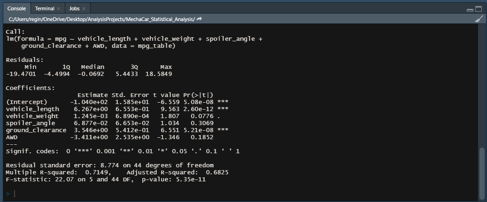
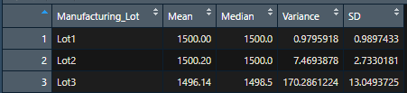
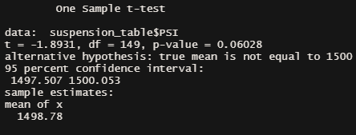
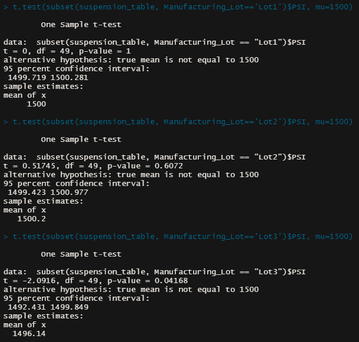

# MechaCar_Statistical_Analysis

## Overview

AutosRUs’ newest prototype, the MechaCar, is suffering from production troubles that are blocking the manufacturing team’s progress. The following analysis was performed to give insights to the manufacturing team: 
* Perform multiple linear regression analysis to identify which variables in the dataset predict the mpg of MechaCar prototypes
* Collect summary statistics on the pounds per square inch (PSI) of the suspension coils from the manufacturing lots
* Run t-tests to determine if the manufacturing lots are statistically different from the mean population
* Design a statistical study to compare vehicle performance of the MechaCar vehicles against vehicles from other manufacturers. For each statistical analysis, you’ll write a summary interpretation of the findings.

*Tools and Resources*
 * [MechaCar MPG Dataset](https://github.com/r3ginam/MechaCar_Statistical_Analysis/blob/main/MechaCar_mpg.csv)
 * [MechaCar Suspension Coil Dataset](https://github.com/r3ginam/MechaCar_Statistical_Analysis/blob/main/Suspension_Coil.csv)
 * Software: R, RStudio, R dplyr library
 * Code: [RScript](https://github.com/r3ginam/MechaCar_Statistical_Analysis/blob/main/MechaCarChallenge.R)

## Linear Regression to Predict MPG

* Which variables/coefficients provided a non-random amount of variance to the mpg values in the dataset?
  - Vehicle Length and Ground Clearance 
* Is the slope of the linear model considered to be zero? Why or why not?
  - No, it is not zero because there are variables showing correlation to the mpg.
* Does this linear model predict mpg of MechaCar prototypes effectively? Why or why not?
  - This model can predict up to 71% of the mpg. It has some variability that cannot be explained by this model, but overall, it can predict mpg. 

## Trip Analysis

* The design specifications for the MechaCar suspension coils dictate that the variance of the suspension coils must not exceed 100 pounds per square inch. Does the current manufacturing data meet this design specification for all manufacturing lots in total and each lot individually? Why or why not?
  - Lot 1 and 2 meet the specification, but Lot 3 does not with a variance of 170 psi. 

## T-Tests on Suspension Coils

## Study Design: MechaCar vs Competition 

__METRICS TO TEST__
How does the yearly maintenance cost (oil change, tire rotation, and air filter cost) of the MechaCar compare to the competition?

__HYPOTHESIS__
Null: The mean maintenance cost of the MechaCar per year is the same as the competition.

Alternative: The mean maintenance cost of the MechaCar is less than the competition.

__STATISTICAL TEST__
Two sample t-test

__DATA REQUIRED__
* Cost of oil changes at MechaCar dealership across the US compared to competition dealerships
* Cost of tire rotations at MechaCar dealerships across the US compared to competition dealerships
* Cost of air filter changes at MechaCar dealerships across the US compared to competition dealerships
